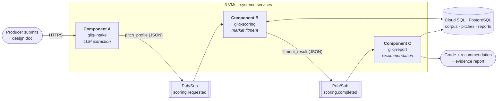

# GreenlightIQ

**Automated game-pitch fitment review for publisher acquisitions teams.**

[](https://www.gnu.org/licenses/agpl-3.0)

🚧 **Status: under active development.** Architecture is settled; implementation is in progress.

---

## What it does

Over 19,000 games shipped on Steam in 2025. Publishers receive far more pitches than they can fund, and greenlight decisions get made under real uncertainty — a producer pulls up a few comparable titles, eyeballs their reception, and guesses at market saturation. That process is slow, inconsistent between reviewers, and prone to two expensive failure modes: **funding a title into an oversaturated niche**, and **passing on a title that fit a proven, underserved one**.

GreenlightIQ automates the first-pass screen. Submit a game design document and the system:

1. **Extracts** the pitch's defining attributes — genre, sub-genres, tags, core mechanics, art style, price tier, target platform.
2. **Benchmarks** those attributes against a market dataset of released Steam titles, computing niche saturation, hit rate, estimated sales distribution, and price alignment.
3. **Returns** a letter grade, an investment tier (*Greenlight / Conditional / De-risk / Pass*), and an evidence report of comparable successes and failures.

It turns gut-feel triage into a repeatable, auditable screen. Every recommendation ships with the comps and assumptions behind it, so a greenlight — or a pass — can be defended to leadership.

> **This is decision support, not a funding authority.** A human still owns the call.

## Architecture

Three independent processes, one per VM, coordinated entirely through managed Google Cloud services.



### Components

| | Process | Input → Output | Responsibility |
| :--- | :--- | :--- | :--- |
| **A** | `gliq-intake` | design doc → `pitch_profile` | Public HTTPS entry point. Uses an LLM to convert unstructured prose into a validated, machine-comparable record. |
| **B** | `gliq-scoring` | `pitch_profile` → `fitment_result` | Matches the profile against the comps corpus, computes weighted sub-scores, maps to a letter grade. **Rule-based and deterministic** — no LLM in the scoring path. |
| **C** | `gliq-report` | `fitment_result` → report | Maps the score to an investment tier, renders the evidence report, persists results and notifies. |

### Cloud services

| Category | Service | Why it's needed |
| :--- | :--- | :--- |
| **Queuing** | Pub/Sub — `scoring-requested` | A→B work queue: ack deadline, retry backoff, dead-letter after 5 attempts, competing-consumer pull. B acknowledges only once a pitch is scored and persisted. |
| **Messaging** | Pub/Sub — `scoring-completed` | B→C event fan-out. B publishes a fact without knowing its consumers, so slow extraction never blocks scoring and scoring never blocks reporting. |
| **Database** | Cloud SQL (PostgreSQL) | The Steam comps corpus plus every pitch, result, decision and rendered report — the audit trail that makes a recommendation defensible. |

⛔ **No caching layer.** The only plausible cache target is `corpus.fetch_candidates`, and at this system's throughput a Redis instance would exist to be demonstrated rather than used. ➡️ [ARCHITECTURE.md §7](docs/ARCHITECTURE.md) records the reasoning and the counter-argument.

### Networking

Only Component A is publicly reachable — static external IP, nginx, Let's Encrypt, served at `greenlightiq.fredt.io`. Components B and C use Pub/Sub **pull** subscriptions, so they need no inbound endpoints, no public IPs, and no load balancer. Administrative access to all three VMs runs over **Tailscale**; public SSH is closed.

### Infrastructure as Code

All GCP resources are declared in a **Pulumi** stack under `infra/`, so the entire environment can be stood up and torn down with a single command.

## Market data & the estimation assumption

The comps corpus is built from a publicly available Steam dataset (genre, tags, price, release date, review counts) with optional live enrichment from the [SteamSpy API](https://steamspy.com/api.php).

⚠️ **Steam does not publish unit sales.** GreenlightIQ estimates them from public proxies:

- **Review-count method (Boxleiter):** estimated units ≈ review count × an era-adjusted multiplier
- **SteamSpy owner bands** where available

These are **disclosed as assumptions in every report**. The system benchmarks *relative* market fitment, not audited revenue. This is a deliberate scope decision — it keeps scoring fully deterministic and reproducible, and avoids brittle live scraping.

📄 **The dataset is not committed to this repository.** Steam data carries its own licensing terms, separate from this project's AGPLv3. The ETL script is committed; setup fetches the data.

## Repository layout

```
components/{intake,scoring,reporting}/   # the three deployable processes
shared/                                  # pydantic schemas: pitch_profile, fitment_result
data/                                    # Kaggle -> Cloud SQL ETL, SteamSpy enrichment client
infra/                                   # Pulumi stack, systemd units, provisioning
samples/                                 # example pitch documents
tests/
docs/                                    # architecture, deployment, evidence
```

## Getting started

🚧 Setup instructions land with the first deployable milestone. See [`docs/DEPLOYMENT.md`](docs/DEPLOYMENT.md).

Component A supports a **`fixture` LLM provider** that returns a canned `pitch_profile`, so Components B and C are fully developable and testable with no API key and no network access.

## Scope

**In scope (MVP):** the three-component pipeline above, rule-based deterministic scoring over a static corpus, Markdown/HTML report output, deployed on GCP via Pulumi.

**Out of scope, tracked as stretch goals:** live data scraping, a full web front-end, Cloud Tasks as a dedicated work queue, and replacing the rule-based scorer with an agentic "acquisitions analyst" that autonomously drafts an investment memo.

## License

**GNU Affero General Public License v3.0** — see [`LICENSE`](LICENSE).

AGPL was chosen deliberately. GreenlightIQ is a network service, and AGPL §13 requires that anyone who modifies it and offers it over a network also offer users the corresponding source. GPLv3 would not reach that case.

⚠️ **Contributions:** a Contributor License Agreement is required before external contributions can be accepted, to keep copyright ownership consolidated.

Copyright © 2026 Fred Teumer.

---

<sub>🎓 Built for the Johns Hopkins University AI Engineering Certificate — Cloud-Based System Design Individual Project.</sub>
